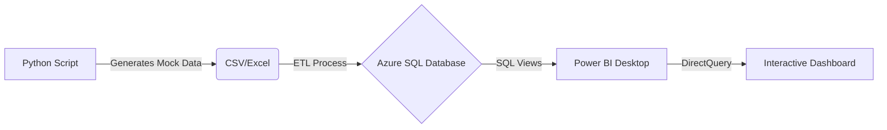

# 🚛 Maroc Logistique: Performance Hub 2026 (Azure + Power BI)


## 📋 Executive Summary
**Maroc Logistique Performance Hub** is an enterprise-grade Analytics Solution designed to modernize supply chain tracking in Morocco. Moving away from static Excel files, this project implements a **Modern Data Stack** (MDS) using **Microsoft Azure SQL** for storage and **Power BI** for real-time decision-making.

The dashboard serves as a "Control Tower" for logistics directors, offering instant visibility into **Profit Margins**, **Supplier Latency**, and **Regional Delivery Success** across the Kingdom.

---

## 🏗️ Technical Architecture
This project simulates a high-volume logistics network handling 10,000+ monthly transactions.



### 🛠️ The Stack

* **Data Generation (Python):** Custom script (`generate_logistics.py`) using `Faker` and `Pandas` to create realistic Moroccan supply chain scenarios (Orders, Returns, Delays).
* **Cloud Storage (Azure SQL):** Hosted relational database to simulate an enterprise data warehouse.
* **Data Modeling (SSMS 2022):** Created optimized SQL Views (`v_Rapport_Logistique`) to pre-aggregate daily KPIs and reduce load time.
* **Visualization (Power BI):**
* **Custom GIS:** Integrated `morocco_regions.json` (TopoJSON) for accurate regional mapping (Souss-Massa, Tanger-Tétouan).
* **DAX Measures:** Complex calculations for *Net Profit Margin*, *Delivery Success Rate*, and *YoY Growth*.
* **UI/UX:** Professional "Dark Mode" interface optimized for executive presentations.

---

## 📊 Dashboard Key Features

### 1. 🌍 Geospatial Intelligence (Custom Maps)

Unlike standard maps, this solution uses a custom **Shape Map** to visualize revenue distribution across specific administrative regions of Morocco.

* *Insight:* Instantly identify underperforming zones (e.g., Low sales in L'Oriental).

### 2. 📉 Real-Time Profit Tracking

Dynamic financial cards that calculate **Net Profit** vs. **Gross Revenue** instantly.

* *Logic:* `Net Margin = (Revenue - Cost - Shipping) - Returns_Cost`

### 3. 🚚 Supply Chain Reliability Scorecard

Tracks the **"Average Delivery Days"** and **"Success Rate"** per supplier.

* *Use Case:* Negotiate better terms with suppliers who consistently delay shipments.

---

## 📂 Project Structure

```text
maroc-logistics-control-tower/
│
├── 📁 data_generation/          # Python scripts for data simulation
│   ├── generate_logistics.py
│   └── raw_data_sample.xlsx
│
├── 📁 database/                 # SQL Schemas & Views
│   ├── create_tables.sql
│   └── create_views.sql         # v_Rapport_Logistique logic
│
├── 📁 maps/                     # Geospatial files
│   └── morocco_regions.json     # Custom TopoJSON for Power BI
│
├── 📁 dashboard/                # The Power BI Solution
│   ├── Logistics_Dashboard.pbix
│   └── screenshots/             # Images for documentation
│       └── main_dashboard.png   # (Ensure image is named exactly this)
│
└── README.md                    # Project Documentation

```

---

## 🚀 How to Run This Project

### Prerequisites

* Python 3.8+ (for data generation)
* Power BI Desktop
* Access to a SQL Server instance (Local or Azure)

### Setup Steps

1. **Generate Data:** Run the python script to create the dataset.
```bash
cd data_generation
python generate_logistics.py

```


2. **Database Setup:** Execute `create_tables.sql` in SSMS to build the schema, then import the CSV/Excel data.
3. **Connect Power BI:** Open `Logistics_Dashboard.pbix`. If you have a local SQL instance, update the "Data Source Settings" to point to your server `(localhost)`.

---

## 📸 Screenshots

### Main "Control Tower" Dashboard
[dashboard/dashboard.png](https://github.com/afwalid37-art/azure-logistics-control-tower/blob/main/dashboard/dashboard.png)


## 👤 Author

**El Walid El Alaoui**

* **Role:** Data Engineer & Business Intelligence Developer
* **Focus:** Azure, SQL, Python, Power BI
* [LinkedIn](https://www.linkedin.com/in/el-walid-el-alaoui-fels-51491538b/)
* [Malt]([https://www.google.com/search?q=https://www.malt.com/profile/YOUR_MALT_ID](https://www.malt.com/profile/elwalidelalaouifeks))

```

```
