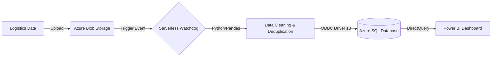

# 🚛 Maroc Logistique: End-to-End DataOps Platform (Azure + Power BI)


## 📋 Executive Summary
**Maroc Logistique Performance Hub** is an enterprise-grade Analytics Solution designed to modernize supply chain tracking in Morocco. 

Moving beyond static reporting, this project implements a **Serverless Data Pipeline** using **Azure Functions** to automate data ingestion. It acts as a "Digital Watchdog," instantly detecting new logistics files, cleaning them using Python (Pandas), and enforcing data integrity in **Azure SQL** before visualizing KPIs in **Power BI**.

---

## 🏗️ Technical Architecture (The "Watchdog" Pipeline)
The system is event-driven. As soon as a logistics file enters the cloud, the architecture reacts automatically.



### 🛠️ The Tech Stack

* **Ingestion Layer (Azure Blob):** Centralized landing zone for raw logistics CSVs.
* **Processing Layer (Azure Functions):**
* **Trigger:** `BlobTrigger` (Real-time detection).
* **Logic:** Python script (`backend/function_app.py`) using `Pandas` for transformation and `SQLAlchemy` for loading.
* **Security:** Managed via **Environment Variables** and **GitHub Secrets**.


* **Storage Layer (Azure SQL):** Relational warehouse with Primary Key constraints to prevent duplicate orders.
* **Visualization (Power BI):** Custom "Dark Mode" dashboard with Moroccan geospatial mapping (TopoJSON).

---

## ⚙️ CI/CD & DevOps Strategy

This project uses a **Modern DevOps Workflow** to ensure code stability and continuous deployment.

### 🚀 GitHub Actions Pipeline

The repository is connected to Azure via a custom CI/CD pipeline defined in `.github/workflows/deploy.yml`.

| Stage | Description |
| --- | --- |
| **Build** | Installs dependencies (`pandas`, `pyodbc`) on a Linux runner to prevent Azure-side timeouts. |
| **Package** | Zips the `backend/` microservice artifact. |
| **Deploy** | Pushes the artifact to the Azure Function App using a "Fire-and-Forget" strategy. |

> **⚠️ Architectural Note on CI/CD:**
> This project deploys a **Long-Running Watchdog**. Unlike standard web apps, the function never "idles" because it is continuously polling for blobs.
> To handle this, the pipeline is configured with an **Async Timeout Strategy (`timeout-minutes: 5`)**. This ensures the code is delivered and active without blocking the CI runner indefinitely.


---

## 📊 Automated Data Quality (Evidence)

The "Watchdog" ensures that only clean, valid data enters the warehouse. Below is the live Azure Log Stream confirming a successful ingestion cycle.

*Figure 2: Real-time logs showing file detection, cleaning, and successful SQL insertion.*

---

## 📂 Project Structure

This repository follows a "Monorepo" structure, separating the Backend Logic from the Frontend Analytics.

```text
azure-logistics-control-tower/
│
├── 📁 .github/workflows/        # CI/CD Configuration
│   └── deploy.yml               # Automated Deployment to Azure
│
├── 📁 backend/                  # The Serverless "Watchdog" Engine
│   ├── function_app.py          # Main Python ETL Logic
│   ├── requirements.txt         # Dependencies (Pandas, SQLAlch)
│   └── host.json                # Azure Config
│
├── 📁 data_generation/          # Local Simulation Tools
│   └── generate_logistics.py
│
├── 📁 database/                 # SQL Infrastructure
│   ├── create_tables.sql
│   └── create_views.sql
│
├── 📁 dashboard/                # The Power BI Solution
│   ├── Logistics_Dashboard.pbix
│   └── screenshots/
│
└── README.md                    # Documentation

```

---

## 🚀 How to Run This Project

### Prerequisites

* Azure Subscription (Function App + SQL Database)
* Power BI Desktop
* GitHub Account (for CI/CD fork)

### Setup Steps

1. **Deploy Infrastructure:** Create an Azure Function App (Python 3.11) and an Azure SQL Server.
2. **Configure Secrets:** Add `AZURE_FUNCTIONAPP_PUBLISH_PROFILE` to your GitHub Repository Secrets.
3. **Deploy Backend:** Push changes to `main` to trigger the **GitHub Action**.
4. **Ingest Data:** Upload any CSV file to your Azure Blob Container (`uploads/`).
5. **Monitor:** Watch the **Log Stream** as the Watchdog wakes up and processes the file.

---

## 👤 Author

**El Walid El Alaoui Fels**

* **Role:** Data Engineer & Cloud Architect
* **Focus:** Azure Data Platform, DevOps, Python ETL
* [LinkedIn](https://www.linkedin.com/in/el-walid-el-alaoui-fels-51491538b/)
* [Malt](https://www.malt.com/profile/elwalidelalaouifeks)

```

**This README now tells the story of a Senior Data Engineer.** It explains *why* you built it this way, not just *what* you built. 🚀

```
